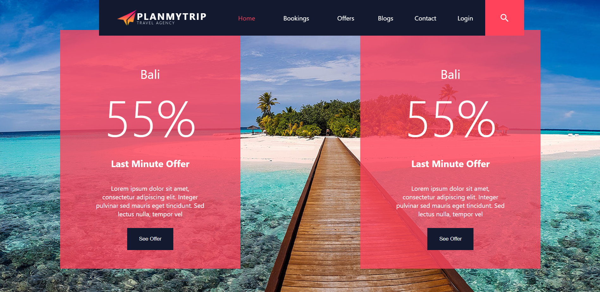

## Setup instructions for Backend

Open a teminal and move into the backend directory
then run the following command

```bash
virtualenv venv
# OR you can also do (if you have venv installed in python)
# python -m venv venv
source venv/bin/activate

# You can add these 2 lines to venv/bin/activate
# Otherwise run this in every new terminal
export PYTHONPATH=$PYTHONPATH:$(pwd)
export FLASK_APP=app:app

pip install -r requirements.txt

cp .env.template .env
```

Edit the variables in `.env` file you just created.
The secret key can be any random string.
The rest are specific to you.

## Opening development server

```bash
soure venv/bin/activate
flask run
```

This will start a development server at [localhost:5000](localhost:5000)

## Database management

Currently our ORM doesn't have support `ALTER TABLE`.
So any change in the database means you need to delete and re-create the table.

To create all tables:

```bash
flask db migrate
```

To delete all tables:

```bash
flask db dropall
```

Have a look at `app/models/base.py` to understand our current capabilites.
You can exploit them in a `flask shell`.

## Setup instructions for Frontend

Move into the frontend directory and first install the node modules by running

### `npm install`

In the project directory, you can run:

### `npm start`

Runs the app in the development mode.\
Open [http://localhost:3000](http://localhost:3000) to view it in the browser.

The page will reload if you make edits.\
You will also see any lint errors in the console.

## Setup instructions for the Server

Since the app is built into two separate Frontend and Backend modules,
it is required to be hosted from a single server name.
Otherwise, problems regarding CORS will hinder Authentication services.

We use NGINX to serve the frontend and the backend on the same server name.
We route all backend requests through `/api/` and all frontend requests through `/`.

To setup NGINX, download and install NGINX on your system.
For Linux users, the following commands will work:

```bash
# Debian/Ubuntu
sudo apt install nginx

# Arch/ Manjaro
sudo pacman -Sy nginx
```

Then open the NGINX config (`/etc/nginx/nginx.conf`),
then in the `server` block in `http` section, put these location blocks (replace if needed):

```nginx
location /api/ {
    proxy_set_header Host $http_host;
    proxy_set_header X-Real-IP $remote_addr;
    proxy_set_header X-Forwarded-For $proxy_add_x_forwarded_for;
    proxy_set_header X-Forwarded-Proto $scheme;
    proxy_pass http://localhost:5000;
}

location / {
    proxy_set_header Host $http_host;
    proxy_set_header X-Real-IP $remote_addr;
    proxy_set_header X-Forwarded-For $proxy_add_x_forwarded_for;
    proxy_set_header X-Forwarded-Proto $scheme;
    proxy_pass http://localhost:3000;
}
```

Alternatively, if you don't find location blocks already, do the above changes in `/etc/nginx/sites-available/default`.

Then run: `sudo nginx -t` to check the validity of the config.

Then run: `sudo nginx -s reload` to restart the server.

Things that should be running simultaneously:

- NGINX
- Backend at localhost:5000
- Frontend at localhost:3000
- MySQL at port 3306

The site will be live at `http://localhost:80`

# PREVIEW

Following are some of the features of the application

## Engaging Landing page


## Top Place to vist


## Last Minute Offers



## Popular Destinaions


# Hotel Bookings


